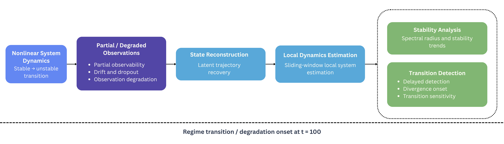
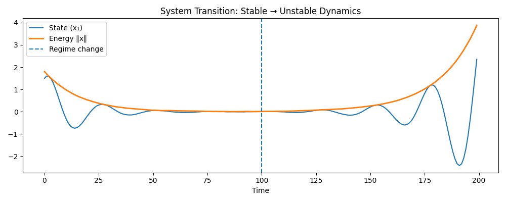
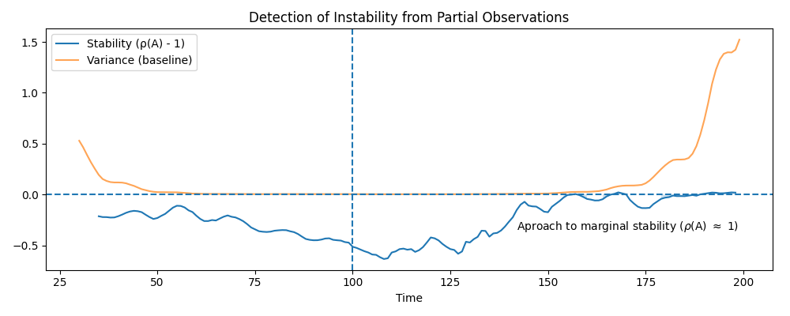
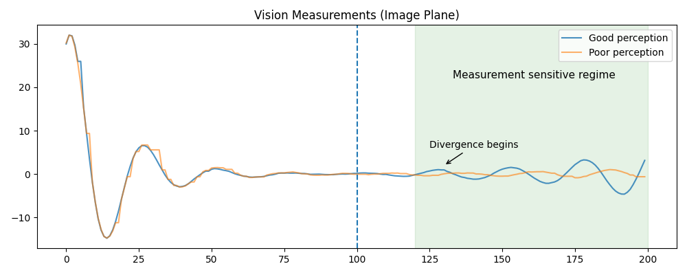
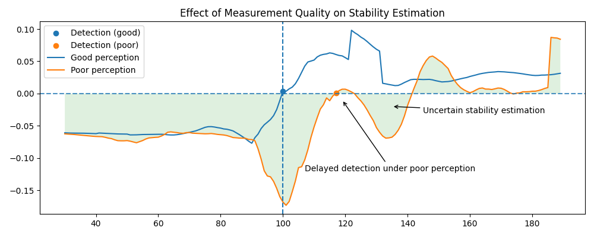

# Latent Dynamics and Stability Transition Analysis

## Abstract

This project studies how stability transitions in nonlinear dynamical systems can be inferred from partial and degraded observations. Local dynamics estimation and reconstruction-based analysis are used to detect transitions between stable and unstable operating regimes, with emphasis on latent instability growth, reconstruction divergence, and degradation-sensitive stability estimation. The framework evaluates how observation quality influences the ability to recover underlying system behavior and identify instability before large-scale divergence occurs.

---

## Core Questions

* How can latent stability transitions be inferred from partial observations?
* How sensitive are local stability estimates to measurement degradation?
* When does reconstruction divergence begin to obscure latent system behavior?
* How does degraded perception delay instability detection?
* Can instability growth be identified before visible trajectory divergence occurs?

---

## System Overview

<p align="center">
  
</p>

The experimental pipeline evaluates how latent dynamical behavior can be recovered from imperfect observations. Nonlinear system trajectories are reconstructed from partial measurements, followed by local dynamics estimation and stability analysis to identify transitions between stable and unstable regimes.

---

## Experimental Pipeline

The analysis framework consists of:

1. **Nonlinear system simulation**
   A time-varying nonlinear dynamical system is simulated with transitions between stable and unstable operating regimes.

2. **Observation generation**
   Partial observations are generated under nominal and degraded sensing conditions.

3. **State reconstruction**
   Latent trajectories are reconstructed from noisy and incomplete measurements.

4. **Local dynamics estimation**
   Sliding-window estimation is used to recover local system dynamics throughout the trajectory.

5. **Stability analysis**
   Eigenvalue-based stability metrics are computed to evaluate evolving dynamical behavior.

6. **Transition detection**
   Stability trends are analyzed to identify the onset of instability and delayed detection under degraded perception.

---

## Measurement Conditions

| Condition             | Characteristics                        | Effect                                                      |
| --------------------- | -------------------------------------- | ----------------------------------------------------------- |
| Nominal perception    | Low-noise observations                 | Stable reconstruction and early transition detection        |
| Degraded perception   | Drift, dropout, and noisy observations | Delayed instability detection and reconstruction divergence |
| Partial observability | Incomplete latent information          | Increased sensitivity to estimation error                   |

---

## Repository Structure

* `src/` — nonlinear dynamics simulation, reconstruction, and stability analysis
* `configs/` — experiment configurations and parameter settings
* `figures/` — generated figures and system overview diagrams
* `experiments/` — experiment execution scripts and evaluation pipelines

---

## Quickstart

```bash id="x82p1d"
git clone https://github.com/afleck18/latent-dynamics-stability.git
cd latent-dynamics-stability

pip install -r requirements.txt

python run.py
```

Experiment parameters can be modified through files in `configs/`.

---

# Key Results

## Figure 1. Stable-to-unstable regime transition

<p align="center">
  
</p>

A nonlinear system transitions from stable to unstable dynamics at ( t = 100 ). State energy initially decays under stable dynamics before rapidly increasing as instability emerges.

---

## Figure 2. Stability estimation from partial observations

<p align="center">
  
</p>

Stability estimates inferred from partial observations approach marginal stability near the latent regime transition, allowing instability growth to be detected before large-scale trajectory divergence fully manifests.

---

## Figure 3. Reconstruction divergence under degraded perception

<p align="center">
  
</p>

Under degraded perception, reconstruction quality deteriorates as drift and intermittent dropout accumulate. Divergence between nominal and degraded observations becomes increasingly visible within degradation-sensitive operating regions.

---

## Figure 4. Stability estimation under degraded perception

<p align="center">
  
</p>

Degraded perception delays stability transition detection and increases uncertainty in local stability estimates. Instability detection occurs later under degraded sensing conditions despite identical underlying system dynamics.

---

# Key Observations

### Stability transitions can be inferred from partial observations

Local dynamics estimation captures latent instability growth even when only partial observations are available. Stability metrics approach marginal behavior near transition regions before large-scale divergence becomes visually apparent.

### Degraded perception delays instability detection

Drift, dropout, and noisy observations reduce the reliability of local dynamics estimates, delaying the identification of unstable operating regimes and increasing uncertainty in inferred system behavior.

### Reconstruction divergence emerges gradually

Under degraded perception, reconstructed trajectories initially remain consistent with nominal observations before progressively diverging as instability and measurement degradation accumulate.

### Transition regions generate elevated estimation sensitivity

Transitions between stable and unstable operating regimes create regions where small reconstruction errors produce disproportionately large changes in estimated stability behavior.

---

## Technical Implementation

### Nonlinear Dynamics

A nonlinear time-varying dynamical system is simulated with regime-dependent dynamics:

$$
x_{k+1} = f(x_k, u_k)
$$

The system transitions from stable to unstable behavior through time-dependent changes in the underlying dynamics.

---

### Observation Model

Partial observations are generated from the latent system trajectory:

$$
y_k = h(x_k) + v_k
$$

Degraded perception conditions introduce drift, dropout, and increased observation noise to evaluate reconstruction robustness and delayed instability detection.

---

### State Reconstruction

Latent trajectories are reconstructed from partial observations prior to local dynamics estimation. Reconstruction quality directly influences inferred stability behavior and transition sensitivity.

---

### Local Dynamics Estimation

Sliding-window estimation is used to recover local system dynamics from reconstructed trajectories. Stability behavior is analyzed through dominant eigenvalue trends and local variance evolution.

---

### Stability Metrics

Stability is evaluated using local spectral behavior and reconstruction variance to estimate the proximity of the inferred system dynamics to instability.

---

## Future Work

* Extend analysis to higher-dimensional nonlinear systems.
* Investigate adaptive windowing strategies for transition-sensitive estimation.
* Incorporate learned latent representations for nonlinear reconstruction.
* Evaluate robustness under severe partial observability and long-duration sensing degradation.
* Compare reconstruction-based stability estimation against observer-based approaches.

---

## Conclusion

This project demonstrates how latent stability transitions can be inferred from partial and degraded observations in nonlinear dynamical systems. Reconstruction-based analysis and local dynamics estimation reveal how measurement quality influences transition detection, instability inference, and estimation sensitivity. These effects become increasingly important in systems operating under partial observability, degradation-sensitive sensing conditions, and evolving nonlinear dynamics.
